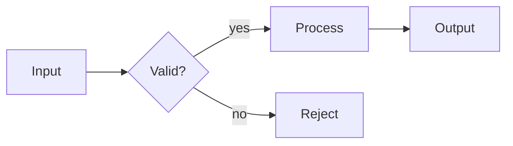
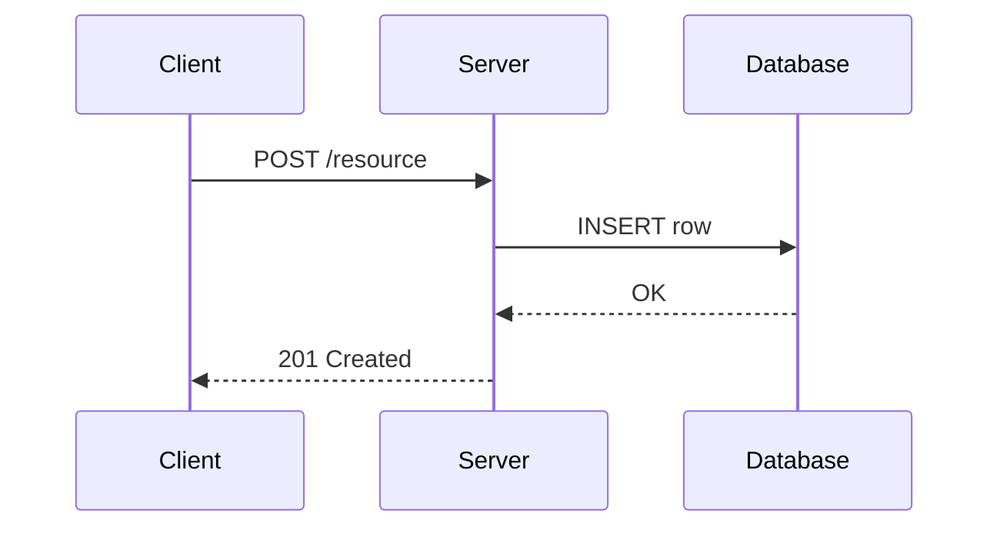
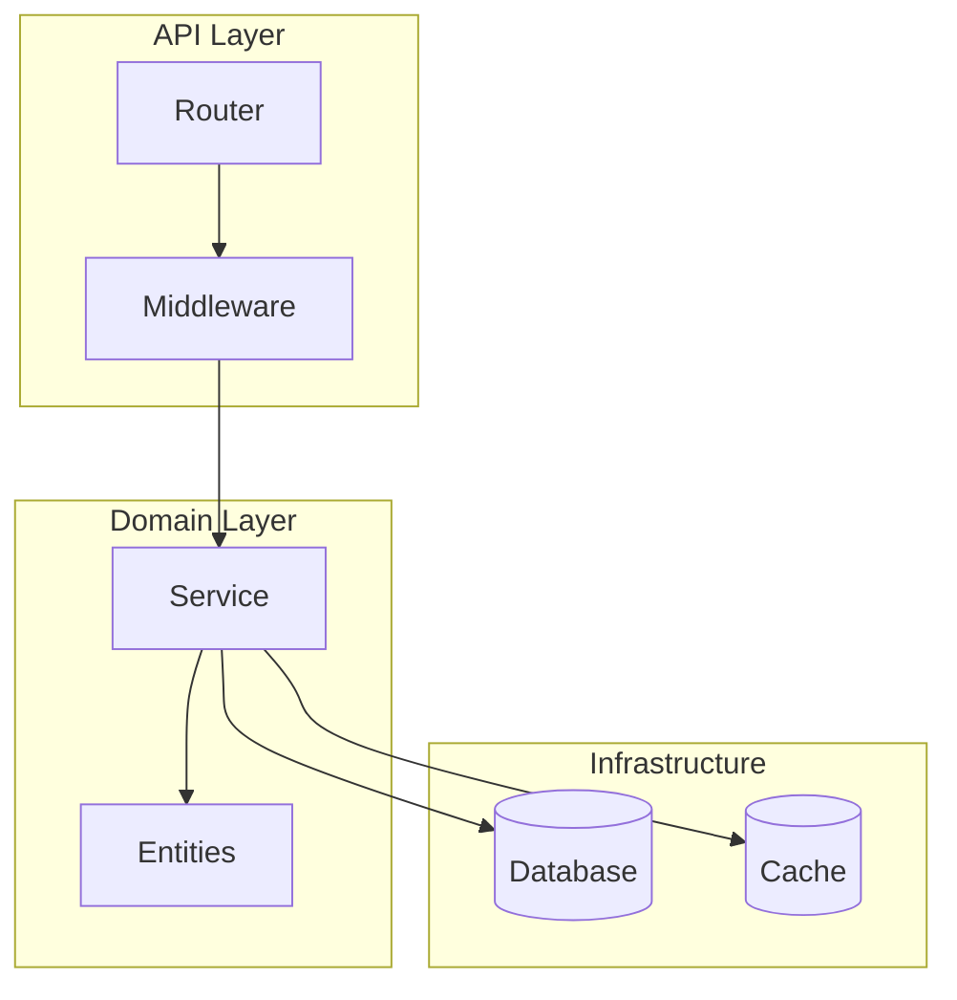
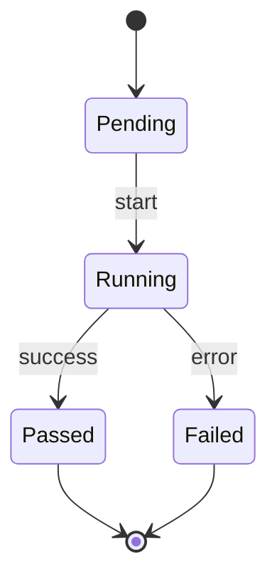

# Mermaid Diagramming

Produce Mermaid diagrams.

## Rules

1. **One diagram per concept.** If a section needs multiple views, use separate fenced blocks with a heading for each.
2. **Keep labels short.** Node labels ≤ 6 words. Use subgraphs for grouping, not long labels.
3. **Decision nodes use `{...}` rhombus shape.** Action nodes use `[...]` rectangles. Terminal/IO nodes use `[/..../]` parallelograms.
4. **Left-to-right for pipelines, top-to-bottom for hierarchies.** Default to `LR` for data flow; `TD` for org charts, call trees, and phase sequences.

## Diagram Types

### Flowchart — processes and pipelines



### Sequence — interactions between actors/services



### Graph with subgraphs — architecture layers



### State diagram — lifecycle / state machine



## Procedure

1. Identify the diagram type that best fits the concept (flowchart, sequence, state, ER, etc.).
2. Draft the structure — nodes, edges, labels — before writing Mermaid syntax.
3. Open the ```` ```mermaid ```` block.
4. Write the diagram type declaration on line 2.
5. Verify the diagram is syntactically valid (balanced brackets, no duplicate node IDs).

## Persist to file

Always persist to a new file unless asked to add to and existing file. Use serena for writing to disk

1. **Slugify** the feature name: lowercase, replace spaces with hyphens, strip special characters. ("User Login with MFA" → `user-login-with-mfa`)
2. **Create** `docs/diagrams/` if missing.
3. **Check** whether `docs/diagrams/<slug>.md` already exists. If yes, ask: overwrite or create a versioned file (`<slug>-v2.md`)?

## Adding a diagram to an existing file

When inserting a diagram into an existing markdown file:

1. Read the file first to understand the document structure and find the right insertion point.
2. Use a second-level heading (`##`) above the diagram block to name the concept.


